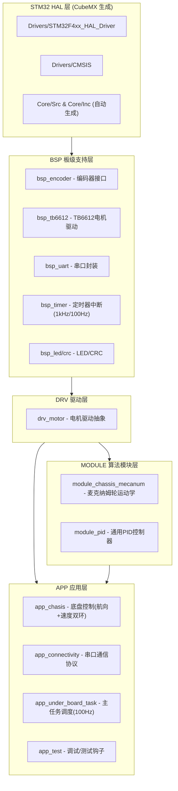

这个是我们小车4个麦轮电机的电控代码，可以克隆到本地后直接打开工作区进行编辑，每完成一次编辑后加到git仓库中并推到云端，备注当前修改的地方。
写代码前需要将本地与云端同步，避免重复编写/漏编。

目前完成的进度如下：
1. CubeMX上按照stm32f401CCU6芯片手册配置引脚与功能关联关系。目前tim1-4分别对应电机A（右后轮，RR），电机B（右前轮，FR），电机C（左前轮，FL），电机D（左后轮，RL）的编码器（encoder），每一个tim只使用2个chanel。
   tim5的四个chanel分别负责四个电机的PWM，chl1-4跟encoder的对应关系相同。tim10做系统时钟，tim9做internal clock。
   
   注意⚠️：这个版本的配置有可能改动，因为今天测试的时候HAL库的调用函数有一点问题，暂时用的tim2当系统时钟（但这会占用tim2以至于电机B无法正常使用encoder模式），后续还会再找老师协商解决方案。

2. 创建USER文件夹，下属app文件夹存放应用/测试代码，drv文件夹存放小车驱动的程序，bsp存放编码器等程序。

3. 完成drv_tb6612文件编写，在drv_tb6612.h文件中对4个电机的gpio串口重新命名，加入其在小车上对应的位置信息（FL/RR等），便于后续麦轮运动学解算代码编写。

4. 完成bsp层中led指示灯代码编写，但暂未测试该串口是否可行。

5. 完成bsp层encoder代码编写，其中包含对编码器读取转速的封装、计算等操作。对tim1/3/4计时器16位溢出问题做了解决。

6. 完成drv层motor文件编写，motor封装了drv_tb6612和encoder的内容，后续应用的时候只需要调用motor中Motor_SetOutputPercent()函数便可直接设置占空比，控制电机转速。

7. 完成算法层pid文件和pid调试入口app_tuner的编写，目前还未烧录测试。

8. 完成算法层麦轮运动学解算，目前小车仍无法保持完美直线前行，后续可能借助c板上的六轴惯性测量单元BMI进行位置校准（研究中，暂未成功）

9. 完成bsp_timer中1kHz和100Hz计时器配置和功能设置。

10. app层仅抄入了例程的测试代码，并非实际任务执行代码。需修改！

11. user文件夹中新增test文件夹，用于存放测试代码。

12. 完成test_pwm和底盘总控程序编写。

13. 完成网络层uart通信代码编写，暂未实现401和407成功通信，研究中。

以下是例程的项目架构，仅作参考。

---

## 工程整体架构概述

### 🎯 项目目标

这是一个基于 **STM32F401xC** (Cortex-M4) 的 **麦克纳姆轮底盘控制系统**，用于 RoboMaster 2026 暑期训练 (Summer EC Demo)。工程名为 **LowerBoard**（下层板），负责四轮独立驱动、速度闭环控制、航向PID控制以及与上位机的串口通信。

---

### 📐 整体架构：分层设计

工程采用清晰的 **5层分层架构**，自下而上为：



---

### 🔌 硬件外设映射

| 外设 | 功能 | 说明 |
|------|------|------|
| **TIM1~TIM4** | 编码器读取 | 4路正交编码器，测量四轮转速 |
| **TIM5 CH1~CH4** | PWM输出 | 4路PWM控制TB6612电机驱动 |
| **TIM10** | 1kHz定时中断 | 系统时基 |
| **TIM11** | 100Hz定时中断 | 主控制循环触发 |
| **USART6** | DMA串口通信 | 与上位机收发协议帧 |
| **CRC** | 帧校验 | 通信协议CRC校验 |
| **GPIOC13** | LED指示 | 板载运行指示灯 |
| **GPIOA/B** | TB6612方向控制 | IN1/IN2方向引脚 |

---

### 🧠 核心控制算法

#### 1. 麦克纳姆轮运动学 (`module_chassis_mecanum`)

采用 **X型布局** 的正逆运动学模型：

- **逆运动学**：将底盘目标速度 $(v_x, v_y, \omega_z)$ 解算为四轮目标转速 (rpm)
- **正运动学**：将四轮实测转速反算回底盘速度，用于反馈上报
- **速度限幅**：等比缩放确保不超出机械极限 ($\pm 282\,\text{rpm}$)

#### 2. 两级 PID 闭环控制 (`app_chasis`)

```
上位机指令 → [航向PID] → wz_radps → [逆运动学] → 四轮目标rpm → [四路速度PID] → PWM占空比输出
              ↑                                                                         ↓
          gyro_yaw_rad                                                             TB6612 → 电机
                                                                                       ↓
                                                                              编码器反馈rpm ←──┘
```

- **外环（航向PID）**：输入为目标偏航角 vs 陀螺仪实测偏航角，输出为 $\omega_z$
- **内环（速度PID）**：四路独立的轮速PID，输入为目标rpm vs 编码器实测rpm，输出为 PWM 占空比百分数

PID参数通过 EzTuner.h 集中管理，支持运行时通过调试器实时调参。

---

### 📡 通信协议 (`app_connectivity`)

基于 **USART6 + DMA + 帧解码器(FrameCodec)** 的串口协议：

- **命令类型**：
  - `COAST` — 惰行（停止输出）
  - `BRAKE` — 刹车
  - `VELOCITY` — 速度控制 $(v_x, v_y, \omega_z)$
  - `HEADING` — 航向控制 $(v_x, v_y, \text{target\_yaw}, \text{gyro\_yaw})$
- **反馈帧**：定期上报底盘实际速度、四轮rpm 等状态
- 支持 **loopback 回环测试** 和错误计数统计
- 使用 CRC 校验保证数据完整性

---

### ⏱️ 主任务调度 (`app_under_board_task`)

以 **100Hz (10ms周期)** 运行的主控制循环：

```
TIM11中断 → 置 flag → main while(1) 轮询
```

每个周期执行：
1. **LED 闪烁**（500ms间隔）
2. **解析串口命令**（支持 COAST/BRAKE/VELOCITY/HEADING）
3. **底盘控制更新**（速度控制 或 航向控制）
4. **发送反馈帧** 给上位机

安全机制：
- **500ms 超时保护**：上位机断连后自动惰行
- **在线/离线状态跟踪**

---

### 🧪 测试模式 (`app_test`)

main.c 中预留了多种测试入口（当前激活 `App_TestMotorSequenceStart()`）：

| 测试函数 | 功能 |
|----------|------|
| `App_TestMotorSequenceStart` | 逐轮开环加减速/刹车测试 |
| `App_TestMotorPIDStart` | 四轮 PID 速度环闭环测试 (+140rpm 梯形波) |
| `App_TestMotorPID70PercentForwardStart` | 四轮70%速度PID调试 |

所有测试变量声明为 `volatile`，可在调试器中实时观察。

---

### 🔑 关键设计特点

1. **CubeMX 兼容**：HAL层代码由CubeMX生成（Core），用户代码完全在 User 目录下
2. **参数集中管理**：EzTuner.h 统一管理所有PID参数和方向配置，支持运行时热更新
3. **安全的延迟初始化**：各模块使用 `Ensure*Inited()` 模式，防止未初始化调用
4. **调试友好**：大量 `volatile` 全局变量，可直接在调试器中观察控制状态
5. **超时保护**：UART 命令超时后自动停止底盘，保障安全

---

### 📊 数据流总结

```
上位机(UART) → FrameCodec解码 → app_connectivity → app_under_board_task(100Hz调度)
                                                          ↓
                                          app_chasis (航向PID + 速度PID ×4)
                                                          ↓
                                          module_chassis_mecanum (运动学)
                                                          ↓
                                          drv_motor (电机抽象层)
                                                          ↓
                                    bsp_tb6612(PWM+方向) + bsp_encoder(编码器读数)
                                                          ↓
                                                    物理电机
```

这是一个结构清晰、层次分明的嵌入式实时控制系统，特别适合作为 RoboMaster 底盘控制的教学和训练平台。
